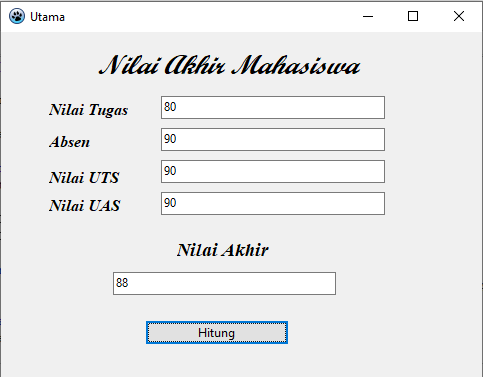

# Nilai Akhir Mahasiswa

### Code

 	// Konversi input pengguna menjadi bilangan pecahan (Double)
  	Tugas := StrToFloat(edtNilai.Text);
  	Absensi := StrToFloat(edtAbsen.Text);
  	UTS := StrToFloat(edtUts.Text);
  	UAS := StrToFloat(edtUas.Text);

  	// Hitung nilai akhir berdasarkan persentase
  	NilaiAkhir := (0.2 * Tugas) + (0.1 * Absensi) + (0.3 * UTS) + (0.4 * UAS);

  	// Tampilkan nilai akhir dalam kotak teks Hasil
  	edtHasil.Text := FloatToStr(NilaiAkhir); 
